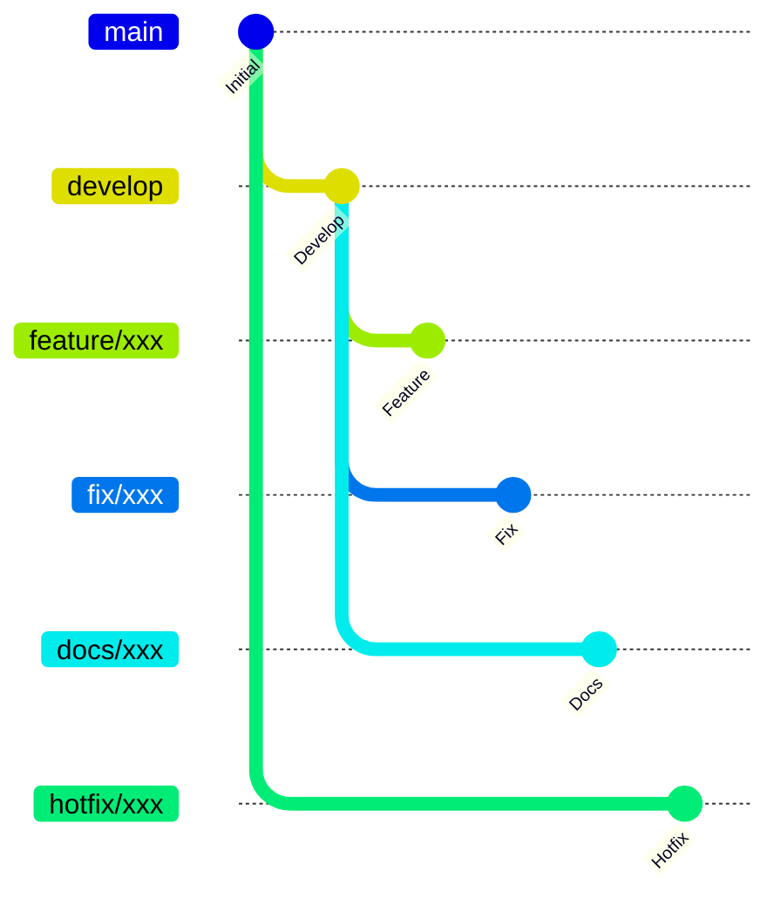
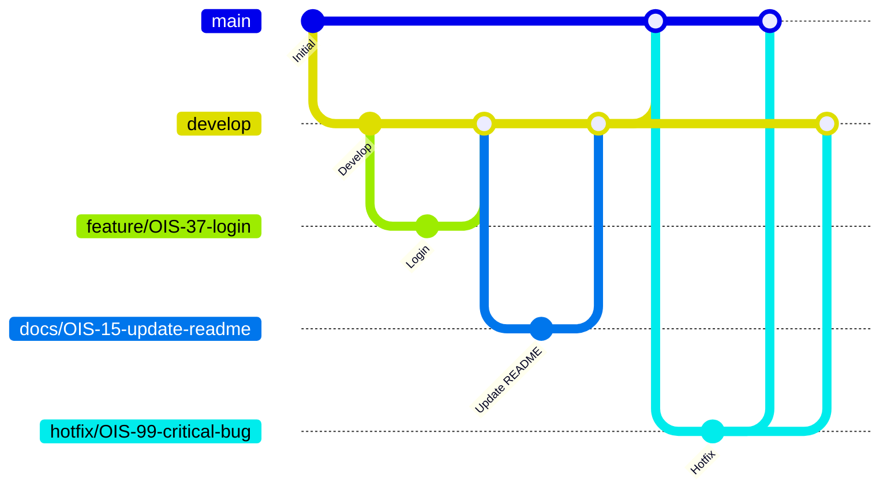

## 目次
- [1. ブランチ名 / ブランチ構成](#1-ブランチ名--ブランチ構成)
- [2. 各ブランチの役割](#2-各ブランチの役割)
- [3. マージ・被マージの流れ](#3-マージ被マージの流れ)
  - [3.1 マージ、被マージの流れの図](#31-mermaid図)
  - [3.2 基本ルール](#32-基本ルール)
  - [3.3 禁止事項](#33-禁止事項)
  - [3.4 例外ルール](#34-例外ルール)
- [4. タスクに対する使用の仕方](#4-タスクに対する使用の仕方)
  - [4.1 使用の仕方](#41-使用の仕方)
  - [4.2 コミットメッセージ Prefix](#42-コミットメッセージ-prefix)
- [5. ブランチ命名規則](#5-ブランチ命名規則)


## 1. ブランチ名/ブランチ構成


```
main
├── develop
│   ├── feature/xxx
│   ├── fix/xxx
│   └── docs/xxx
└── hotfix/xxx
```
&nbsp;  

## 2. 各ブランチの役割

| ブランチ | 役割 |
| --------- | ------------ |
| main | 本番リリース用 |
| develop | 開発の最新状態 |
| feature/* | 機能開発 |
| fix/* | バグ修正 |
| docs/* | README修正 |
| hotfix/* | 緊急修正時 |

&nbsp;  

## 3. マージ、被マージの流れ

### 3.1 マージ、被マージの流れの図

&nbsp;  
### 3.2 基本ルール
* `feature/*`、 `fix/*`、`docs/*` ブランチは、必ず develop ブランチから作成する。
* 機能開発・バグ修正・ドキュメント修正が完了したら、Pull Request を作成し develop ブランチへマージする。
<!-- * develop ブランチには、レビューおよび各種 CI が成功した変更のみをマージする。 -->
* リリース時は develop ブランチを main ブランチへマージする。
* 緊急対応が必要な場合は main ブランチから hotfix/* ブランチを作成して修正を行う。
* hotfix/* ブランチは、修正完了後に main と develop の両方へマージし、修正内容の差分が発生しないようにする。
* 1つのタスクにつき 1つのブランチを作成し、複数のタスクを1つのブランチで作業しない。
* ブランチへの直接 Push は行わず、必ず Pull Request を経由してマージする。
```
feature, fix, docs
↓
develop
↓
main
```
&nbsp;  
### 3.3 禁止事項
* feature/ → main への直接マージは禁止
* fix/* → main への直接マージは禁止
* docs/* → main への直接マージは禁止
* feature/* 同士、fix/* 同士、docs/* 同士のマージは禁止
* develop・main への直接 Push 禁止
```
feature, fix, docs → main
feature, fix, docs → feature, fix, docs
main → feature, fix, docs, hotfix
develop → feature, fix, docs, hotfix
```
&nbsp;  

### 3.4 例外ルール

基本ルールを適用できない状況が発生した場合は、独断で対応せず、チーム内で対応方針を決定する。

特に本番環境の重大な不具合については、通常の開発フローよりも迅速な復旧を優先し、`hotfix/*` ブランチを用いて対応する。

例外対応を行った場合でも、修正内容は `main` と `develop` の両方へ反映し、ブランチ間の差分が残らないようにする。

#### <対応の流れ図>
緊急修正時
mainからhotfixブランチを切る

```
main
└─ hotfix/*
```
  
修正後
main, developブランチ両方へ反映

```
hotfix
↓
main
```
```
hotfix
↓
develop
```

&nbsp;  

## 4. タスクに対する使用の仕方
### 4.1 使用の仕方
* Jiraの1タスク = 1ブランチ
* コミットメッセージは、「prefix(type): 変更点の内容」で記述
* PRタイトルはJiraのタスク名

例

```
Jira → OIS-8 利用者はログイン画面からログインができる
branch → feature/OIS-8-user-login-from-login-screen
commit message → fix: エラーメッセージの文言修正, test: バリデーションのテスト追加
PR title → [OIS-8] 利用者はログイン画面からログインができる
```
&nbsp;  
### 4.2 コミットメッセージ Prefix
Conventional Commits 規約

|type|用途|
|---|---|
|`feat`|新機能の追加|
|`fix`|バグ修正|
|`docs`|ドキュメントのみの変更|
|`style`|コードの動作に影響しない変更（フォーマット、セミコロン等）|
|`refactor`|バグ修正でも機能追加でもないコードの変更|
|`test`|テストの追加・修正|
|`chore`|ビルドプロセスや補助ツールの変更（package.jsonの更新等）|
|`perf`|パフォーマンス改善|
|`ci`|CI設定ファイルの変更|
|`revert`|以前のコミットの取り消し|

&nbsp;  

## 5. ブランチ命名規則


```
種別/タスク番号-内容
```
* タスク内容は、担当者が内容を適切に表現した英語で命名する。
* タスク内容には英小文字のみを使用する。
* 複数の単語で構成する場合は、単語の区切りに -（ハイフン）を使用する。

例

```
feature/OIS-8-login-page
feature/OIS-24-ticket-create
fix/OIS-17-validation-error
docs/OIS-45-readme-update
```

&nbsp;  

