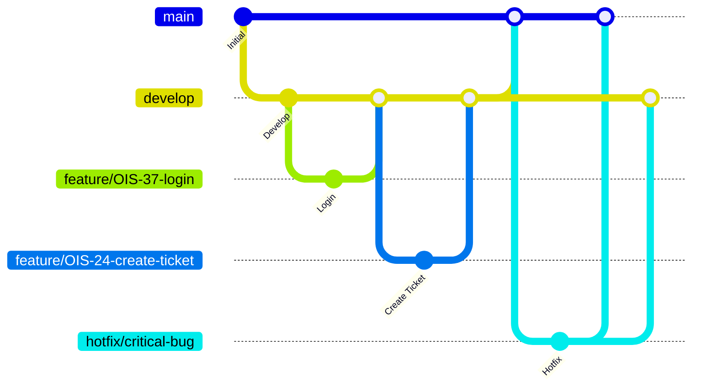

# ブランチ運用ルール

## 目次
- [1. ブランチ名 / ブランチ構成](#1-ブランチ名--ブランチ構成)
- [2. 各ブランチの役割](#2-各ブランチの役割)
- [3. マージ・被マージの流れ](#3-マージ被マージの流れ)
  - [3.1 Mermaid図](#31-mermaid図)
  - [3.2 基本ルール](#32-基本ルール)
  - [3.3 禁止事項](#33-禁止事項)
  - [3.4 例外ルール](#34-例外ルール)
- [4. タスクに対する使用の仕方](#4-タスクに対する使用の仕方)
  - [4.1 使用の仕方](#41-使用の仕方)
  - [4.2 コミットメッセージ Prefix](#42-コミットメッセージ-prefix)
- [5. ブランチ命名規則](#5-ブランチ命名規則)


## 1. ブランチ名/ブランチ構成

```
main
└─ develop
    ├─ feature/xxx
    ├─ fix/xxx
    ├─ docs/xxx
    └─ hotfix/xxx
```
&nbsp;  

## 2. 各ブランチの役割

| ブランチ | 役割 |
| --------- | ------------ |
| main | 本番リリース用 |
| develop | 開発の最新状態 |
| feature/* | 機能開発 |
| fix/* | バグ修正 |
| docs/* | READMEや設計書修正 |
| hotfix/* | 緊急修正時 |

&nbsp;  

## 3. マージ、被マージの流れ

### 3.1 Mermaid図

&nbsp;  
### 3.2 基本ルール

```
feature, fix, docs
↓
develop
↓
main
```
&nbsp;  
### 3.3 禁止事項

```
feature, fix, docs → main
feature, fix, docs → feature, fix, docs
main → feature, fix, docs, hotfix
develop → feature, fix, docs, hotfix
```
&nbsp;  
### 3.4 例外ルール

緊急修正時
mainからhotfixブランチを切る

```
main
└─ hotfix/*
```
  
修正後
main, developブランチ両方へ反映

```
hotfix
↓
main
```
```
hotfix
↓
develop
```

&nbsp;  

## 4. タスクに対する使用の仕方
### 4.1 使用の仕方
* Jiraの1タスク = 1ブランチ
* コミットメッセージは、「prefix(type): 変更点の内容」で記述
* PRタイトルはJiraのタスク名

例

```
Jira → OIS-8 利用者はログイン画面からログインができる
branch → feature/OIS-8-user-login-from-login-screen
commit message → fix: エラーメッセージの文言修正, test: バリデーションのテスト追加
PR title → [OIS-8] 利用者はログイン画面からログインができる
```
&nbsp;  
### 4.2 コミットメッセージ Prefix
Conventional Commits 規約

|type|用途|
|---|---|
|`feat`|新機能の追加|
|`fix`|バグ修正|
|`docs`|ドキュメントのみの変更|
|`style`|コードの動作に影響しない変更（フォーマット、セミコロン等）|
|`refactor`|バグ修正でも機能追加でもないコードの変更|
|`test`|テストの追加・修正|
|`chore`|ビルドプロセスや補助ツールの変更（package.jsonの更新等）|
|`perf`|パフォーマンス改善|
|`ci`|CI設定ファイルの変更|
|`revert`|以前のコミットの取り消し|

&nbsp;  

## 5. ブランチ命名規則


```
種別/タスク番号-内容
```

例

```
feature/OIS-8-login-page
feature/OIS-24-ticket-create
fix/OIS-17-validation-error
docs/OIS-45-readme-update
```

&nbsp;  

