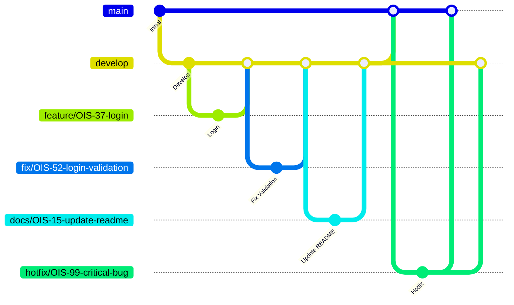

# helpdesk-BE

## 目次
- [1. プロジェクト概要](#1-プロジェクト概要)
  - [1.1 概要](#11-概要)
  - [1.2 利用想定](#12-利用想定)
  - [1.3 フォルダ構成](#13-フォルダ構成)
- [2. 環境構築手順](#2-環境構築手順)
  - [動作環境](#動作環境)
  - [2.1 リポジトリをクローン](#21-リポジトリをクローン)
  - [2.2 poetry設定](#22-poetry設定)
    - [2.2.0 Poetryインストール](#220-poetryインストール)
    - [2.2.1 ライブラリの一括インストールと仮想環境の構築](#221-ライブラリの一括インストールと仮想環境の構築)
  - [2.3 環境変数](#23-環境変数)
  - [2.4 Docker起動(バックエンド起動)](#24-docker起動バックエンド起動)
  - [2.5 Pythonの実行方法](#25-pythonの実行方法)
    - [2.5.1 仮想環境を有効化して実行する](#251-仮想環境を有効化して実行する)
      - [2.5.1.1 ローカルPC上の仮想環境に入る](#2511-ローカルpc上の仮想環境に入る)
      - [2.5.1.2 仮想環境を有効化する](#2512-仮想環境を有効化する)
      - [2.5.1.3 Pythonを実行する](#2513-pythonを実行する)
    - [2.5.2 仮想環境を終了する](#252-仮想環境を終了する)
    - [2.5.3 仮想環境を有効化せずに実行する](#253-仮想環境を有効化せずに実行する)
  - [2.6 動作確認Swaggerの表示](#26-動作確認swaggerの表示)
- [3. Ruffの使用方法](#3-ruffの使用方法)
  - [3.1 CLIから実行する](#31-cliから実行する)
    - [3.1.1 仮想環境を有効化する](#311-仮想環境を有効化する)
    - [3.1.2 Linterを実行する](#312-linterを実行する)
    - [3.1.3 Formatterを実行する](#313-formatterを実行する)
    - [3.1.4 LintとFormatをまとめて実行する](#314-lintとformatをまとめて実行する)
    - [3.1.5 仮想環境を終了する](#315-仮想環境を終了する)
  - [3.2 VSCodeで使用する](#32-vscodeで使用する)
  - [3.3 Lintエラーを修正する](#33-lintエラーを修正する)
- [4. ブランチ運用ルール](#4-ブランチ運用ルール)
  - [4.1 ブランチの概要](#41-ブランチの概要)
    - [4.1.1 ブランチ構成](#411-ブランチ構成)
    - [4.1.2 ブランチの切り方](#412-ブランチの切り方)
  - [4.2 マージ・被マージの流れ](#42-マージ被マージの流れ)
    - [4.2.1 マージ、被マージの流れの図](#421-マージ被マージの流れの図)
    - [4.2.2 基本ルール](#422-基本ルール)
    - [4.2.3 禁止事項](#423-禁止事項)
    - [4.2.4 例外ルール](#424-例外ルール)
  - [4.3 タスクに対する使用の仕方](#43-タスクに対する使用の仕方)
    - [4.3.1 使用の仕方](#431-使用の仕方)
    - [4.3.2 コミットメッセージ Prefix](#432-コミットメッセージ-prefix)
  - [4.4 ブランチ命名規則](#44-ブランチ命名規則)


## 1. プロジェクト概要

### 1.1 概要

社内ヘルプデスク管理システムのバックエンドAPI。
FastAPIを用いたRESTful APIサーバーとして、問い合わせの受付・管理・回答機能を提供する。

&nbsp;

### 1.2 利用想定

社内新人教育プログラムの一環として開発するヘルプデスクサービスのバックエンド。
社員からの問い合わせ(チケット)を受け付け、担当者がシステム上で対応・管理することを想定している。


【社員】
- システム管理者が作成した登録済みアカウントでログインする
- 質問日・公開設定・要件・詳細を入力してチケットを新規作成する
- 自身が作成したチケット、および他の社員が作成した公開設定が「公開」のチケットを閲覧する
- サポート担当とのやりとりを通じて問い合わせ内容の解決を図る

【サポート担当】
- システム管理者が作成した登録済みアカウントでログインする
- 全チケットを一覧で閲覧する
- チケットをアサインして担当者として割り当てる
- チケットのステータスを更新し、社員との質疑応答を通じて対応する

【システム管理者】
- システム上で作成したアカウントでログインし、ユーザーおよびチケットの管理・運用を担う
- ユーザーの登録・削除によりアカウントを管理する
- 全チケットの閲覧・ステータス更新・アサイン変更を行う
- チケットのステータスに応じた積み上げグラフで消費チケット数を把握する

&nbsp;  

### 1.3 フォルダ構成

**<フォルダ構成の設計方針>**

  * 各フォルダは固有の役割を持ち、責務が明確に分離されている。
  * フォルダ・ファイルの役割を超えた処理は記述しないこと。また、1つのフォルダ・ファイルが複数の責務を持たないことをルールとする。
  * 役割に迷った場合は、下記のフォルダ説明を参照し、適切な場所に実装すること。

&nbsp;  

```
helpdesk-BE/
├── src/
│   └── helpdesk_be/              # メインアプリケーションコード（FastAPI）
│       ├── main.py               # FastAPIのエントリーポイント。アプリ全体を束ねる親ファイル
│       ├── api/                  # ルーティング・エンドポイント定義。メソッドを呼び出すだけでロジックは書かない
│       ├── core/                 # FastAPI設定値・DB接続など、API実行前の前処理
│       ├── exceptions/           # ビジネス上エラーとして扱いたい例外の定義
│       ├── handlers/             # 例外ハンドラーの定義
│       ├── loggers/              # BEロジックのログ生成装置を置く場所
│       ├── logic/                # DBにアクセスしないデータ加工・ビジネスロジック
│       ├── models/               # DBのテーブル定義
│       ├── repositories/         # DBへのアクセス（取得・登録）のみを担う
│       ├── schemas/              # リクエスト・レスポンスの型定義
│       └── store/                # 定数・固定値を管理するファイルを置く場所
├── tests/                        # テストコード
│   ├── conftest.py               # pytest共通設定・フィクスチャ
│   ├── api/                      # api層のテスト
│   ├── factories/                # テスト用データ生成
│   ├── logic/                    # logic層のテスト
│   └── repositories/             # repositories層のテスト
├── docker/                       # Docker関連設定ファイル
│   ├── api/Dockerfile            # APIコンテナのビルド定義
│   └── db/                       # DBコンテナの設定
├── .github/                      # GitHub設定（PRテンプレート等）
├── docker-compose.yml            # 開発環境用Docker Compose設定
├── docker-compose.test.yml       # テスト環境用Docker Compose設定
├── pyproject.toml                # Pythonプロジェクト設定・依存関係定義
├── poetry.lock                   # 依存関係のバージョン固定ファイル
├── .env.example                  # 環境変数のサンプルファイル
└── README.md
```

&nbsp;


## 2. 環境構築手順


### 動作環境


* Node.js 26.4.0（2026-06-30現在最新バージョン）
* Python 3.14（2026-06-30現在最新バージョン）
* Poetry 2.3.3
* Docker Desktop

---
&nbsp;  
### 2.1 リポジトリをクローン
階層構成は、helpdeskフォルダ配下にhelpdesk-BEとhelpdesk-FEがある想定。

自身の環境にクローン先のフォルダの用意をし、用意したフォルダ配下でコマンドを実行する。

&nbsp;  

```bash
git clone git@github.com:OzasaHitomi/helpdesk-BE.git
```
&nbsp;  
---
&nbsp;  
### 2.2 poetry設定

#### 2.2.0 Poetryインストール
* Poetryインストール
  * 自身の環境にpoetryが入っていない場合、インストールする
  * 自身の環境にpoetryが入っている場合、2.2.0の工程は不要
* homebrewからpoetryをインストールする場合の例

```bash
brew install poetry
```
#### 2.2.1 ライブラリの一括インストールと仮想環境の構築
* poetry.lock（依存関係が固定されたファイル）から、その正確なバージョンに従って、Pythonプロジェクトにおける必要なライブラリの一括インストールと仮想環境の構築を同時に行う

```bash
poetry install
```
&nbsp;  
---
&nbsp;  
### 2.3 環境変数

`.env.example` を参考に、以下のファイルをルートディレクトリに作成し必要な値を設定する。
* .envファイル（開発環境設定）
* .env.test.unit（テスト環境設定）

&nbsp;  

---
&nbsp;  
### 2.4 Docker起動（バックエンド起動）

Dockerを起動するには、docker-compose.ymlファイルがあるルートフォルダ配下でコマンドを実行する。

* 開発環境のDocker起動
```bash
docker compose up -d
```
* testのDocker起動
```bash
docker compose -f docker-compose.test.yml up -d
```
&nbsp;  
---
&nbsp;  

### 2.5 Pythonの実行方法
#### 2.5.1 仮想環境を有効化して実行する

##### 2.5.1.1 ローカルPC上の仮想環境に入る
PythonをローカルPC上の仮想環境で実行するために、`pyproject.toml` があるプロジェクトルートで以下のコマンドを実行する。

```bash
poetry env activate
```

&nbsp;

##### 2.5.1.2 仮想環境を有効化する
`poetry env activate` を実行すると、仮想環境を有効化するためのコマンドが表示される。

表示された `source .../activate` を実行する。

※ パスは環境によって異なるため、以下は一例。

```bash
source /Users/username/project/.venv/bin/activate
```

&nbsp;

##### 2.5.1.3 Pythonを実行する

仮想環境が有効化された後は、通常どおり python コマンドでプログラムを実行できる。

python の後ろには実行したいPythonファイルのパスを指定する。パスは、コマンドを実行しているディレクトリからの相対パスで指定する。

例

```bash
python app/main.py
```

&nbsp;

#### 2.5.2 仮想環境を終了する

有効化した仮想環境を終了し、ローカルPCのPython環境に戻る。

```bash
deactivate
```

&nbsp;  

#### 2.5.3 仮想環境を有効化せずに実行する

仮想環境を有効化しなくても、コマンドの先頭に`poetry run` を付けることで、Poetryが自動的に仮想環境を使用してコマンドを実行する。

python の後ろには実行したいPythonファイルのパスを指定する。パスは、コマンドを実行しているディレクトリからの相対パスで指定する。

例

```bash
poetry run python app/main.py
```

```bash
poetry run pytest
```


&nbsp;  
---
&nbsp;  

### 2.6 動作確認Swaggerの表示

ブラウザでURLを入力し、遷移先でSwagger UIが表示されれば、正常に起動している。

* 開発環境のSwagger

```
http://localhost:8000/docs
```

* テスト環境のSwagger

```
http://localhost:8001/docs
```

&nbsp;  

&nbsp;  

&nbsp;  
---
&nbsp;  

# 3. Ruffの使用方法

Ruffは、コードの静的解析（Linter）とコード整形（Formatter）を行うツールです。

本プロジェクトでは、CLIからの実行と、VSCodeでの自動実行の両方に対応しています。

&nbsp;

### 3.1 CLIから実行する

#### 3.1.1 仮想環境を有効化する


PythonをローカルPC上の仮想環境で実行するために、`pyproject.toml` があるプロジェクトルートで仮想環境を有効化するコマンドを実行する。
詳細は[2.5.1](#251-仮想環境を有効化して実行する)に記載。


&nbsp;

#### 3.1.2 Linterを実行する

コードの構文エラーや未使用のimport、コーディング規約違反などをチェックする。
エラーが表示された場合は、3.1.3で自動修正するか、内容を確認して手動で修正する。

```bash
make lint
```

&nbsp;


#### 3.1.3 Formatterを実行する

コードをプロジェクトのフォーマットルールに従って自動整形する。

```bash
make format-check
```

&nbsp;

#### 3.1.4 LintとFormatをまとめて実行する

LintチェックとFormatを続けて実行する。

```bash
make check
```

&nbsp;

#### 3.1.5 仮想環境を終了する

有効化した仮想環境を終了し、ローカルPCのPython環境に戻る。
詳細は[2.5.2](#252-仮想環境を終了する)に記載。

&nbsp;

### 3.2 VSCodeで使用する

VSCodeでは、保存時にRuffによるコード整形や、自動修正可能なLintエラーの修正を行う。

以下の拡張機能をインストールしておく。

* Python（Microsoft）
* Ruff（charliermarsh）

保存時の動作

* コードを自動整形する
* 自動修正可能なLintエラーを修正する
* import文を自動で整理する

※ `.vscode/settings.json` に設定が含まれているため、拡張機能をインストールすれば追加設定は不要。

&nbsp;

### 3.3 Lintエラーを修正する

`make lint` を実行してエラーが表示された場合は、内容を確認して修正する。

自動修正可能な項目については、`make lint-fix` を実行するか、VSCodeでファイルを保存することで修正される。

&nbsp;

## 4. ブランチ運用ルール

### 4.1 ブランチの概要
#### 4.1.1 ブランチ構成

```
main
├── develop
│   ├── feature/xxx
│   ├── fix/xxx
│   └── docs/xxx
└── hotfix/xxx
```
&nbsp;  

| ブランチ名 | 役割 |
|---|---|
| `main` | 本番環境に反映される安定したコード |
| `develop` | 開発の統合ブランチ。`feature` / `fix` / `docs` ブランチの変更をまとめ、リリース時に `main` にマージする |
| `feature/xxx` | 新機能の開発。完成したら `develop` にマージ |
| `fix/xxx` | バグ修正。完成したら `develop` にマージ |
| `docs/xxx` | ドキュメントの追加・修正。完成したら `develop` にマージ |
| `hotfix/xxx` | 本番障害の緊急対応。`main` から派生し、`main` と `develop` 両方にマージ |


&nbsp; 

<docsブランチで扱うドキュメント>
* README
<!-- * API仕様
* DB設計
* 認証仕様 -->

&nbsp; 

<fixブランチとhotfixブランチの違い>
* fixブランチ → 緊急を要さないコードの修正をする場合
* hotfixブランチ → 緊急で修正が必要な場合

&nbsp;  

#### 4.1.2 ブランチの切り方

作業ブランチは以下の手順で作成する。

&nbsp; 

**① リモートの最新状態を取得する**
```bash
git fetch origin
```
&nbsp; 

**② 起点となるブランチに切り替え、最新の状態にする**

通常の開発ブランチ（feature, fix, docs）は `develop` から作成する。
起点となる`develop` ブランチに切り替え、最新の状態にする
```bash
git checkout develop
git pull origin develop
```

緊急修正ブランチ（hotfix）は `main` から作成する。
起点となる`main` ブランチに切り替え、最新の状態にする
```bash
git checkout main
git pull origin main
```
&nbsp; 

**③ 新しいブランチを作成して切り替える**

通常の開発ブランチ(featureブランチを切った場合)
```bash
git checkout -b feature/OIS-8-login-page
```
緊急修正ブランチ
```bash
git checkout -b hotfix/OIS-99-critical-bug
```

&nbsp;  


### 4.2 マージ・被マージの流れ


#### 4.2.1 マージ、被マージの流れの図

&nbsp;  

#### 4.2.2 基本ルール
<通常開発時>
* `feature/*`、`fix/*`、`docs/*` ブランチは、必ず `develop` ブランチから作成する。
* 機能開発(`feature/*`ブランチ)・バグ修正(`fix/*`ブランチ)・ドキュメント修正(`docs/*` ブランチ)が完了したら、Pull Request を作成し `develop` ブランチへマージする。
* `develop`ブランチには、レビューおよび各種 CI が成功した変更のみをマージする。
* リリース時は `develop`ブランチを `main` ブランチへマージする。
&nbsp;  

<緊急修正時>
* 本番環境の重大な不具合については、通常の開発フローよりも迅速な復旧を優先し、`hotfix/*` ブランチを用いて対応する。
* 緊急対応が必要な場合は `main` ブランチから `hotfix/*` ブランチを作成して修正を行う。
* `hotfix/*` ブランチは、修正完了後に `main` と `develop` の両方へマージし、修正内容の差分が発生しないようにする。
* 緊急修正時のマージは機能開発と同様に、レビューおよび各種 CI が成功した変更のみを、`main` ブランチと`develop`ブランチにマージする。
* 例外対応を行った場合でも、修正内容は `main` と `develop` の両方へ反映し、ブランチ間の差分が残らないようにする。
&nbsp;  

<共通ルール>
* `feature/*`、`fix/*`、`docs/*`、`hotfix/*` などの作業ブランチへの直接 Push は問題ないが、`main` / `develop` へのマージは必ず Pull Request を経由して行う。


&nbsp;  

#### 4.2.3 禁止事項
* `feature/` → `main` への直接マージ
* `fix/*` → `main` への直接マージ
* `docs/*` → `main` への直接マージ
* `feature/*` 同士、`fix/*` 同士、`docs/*` 同士のマージ
* `feature/*`・`fix/*`・`docs/*` 同士のマージ
  * `develop` 配下のブランチは `develop` にのみマージすること
* `develop`・`main` への直接 Push
* レビューが完了していない Pull Request のマージ
* Pull Request を作成した本人によるセルフマージ

&nbsp;  

#### 4.2.4 例外ルール

基本ルールを適用できない状況が発生した場合は、独断で対応せず、チーム内で対応方針を決定する。

&nbsp;  

### 4.3 タスクに対する使用の仕方

#### 4.3.1 使用の仕方
* Jiraの1つのタスクにつき1つのブランチを作成し、複数のタスクを1つのブランチで作業しない。
* コミットメッセージは、「prefix(type): 変更点の内容」で記述する（prefixの詳細は4.3.2を参照）
* PRタイトルはJiraのタスク名とする。

例

```
Jira → OIS-42 ブランチ運用ルールの制定
branch → feature/OIS-42-branch-rule
commit message → fix: マーメイド図の修正
PR title → [OIS-42] ブランチ運用ルールの制定
```
&nbsp;  

#### 4.3.2 コミットメッセージ Prefix
Conventional Commits 規約

|type|用途|
|---|---|
|`feat`|新機能の追加|
|`fix`|バグ修正|
|`docs`|ドキュメントのみの変更|
|`style`|コードの動作に影響しない変更（フォーマット、セミコロン等）|
|`refactor`|バグ修正でも機能追加でもないコードの変更|
|`test`|テストの追加・修正|
|`chore`|ビルドプロセスや補助ツールの変更（package.jsonの更新等）|
|`perf`|パフォーマンス改善|
|`ci`|CI設定ファイルの変更|
|`revert`|以前のコミットの取り消し|

&nbsp;  

### 4.4 ブランチ命名規則

```
種別/タスク番号-内容
```
* タスク内容は、担当者が内容を適切に表現した英語で命名する。
* タスク内容には英小文字のみを使用する。
* 複数の単語で構成する場合は、単語の区切りに -（ハイフン）を使用する。

例

```
feature/OIS-8-login-page
fix/OIS-17-validation-error
docs/OIS-45-readme-update
hotfix/OIS-OIS-99-critical-bug
```

&nbsp;  

&nbsp;  
